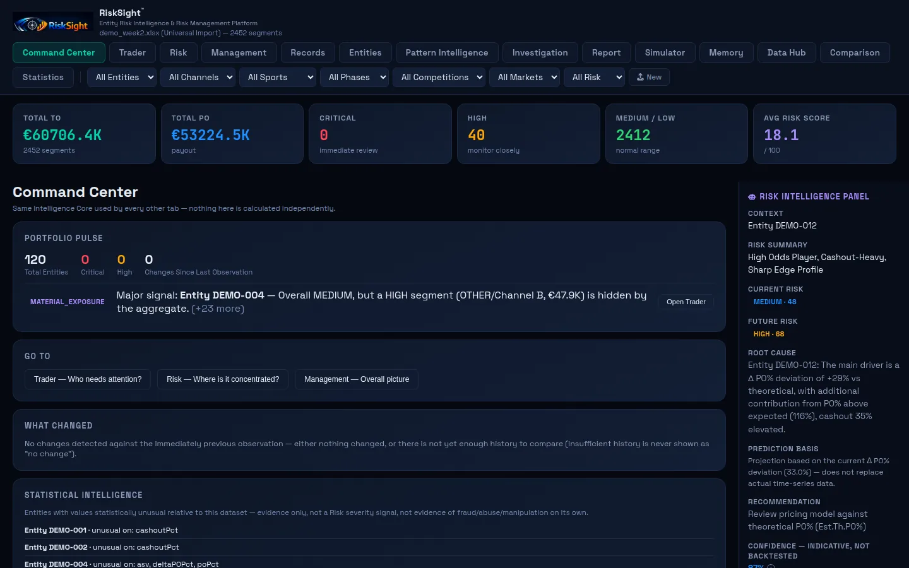

# RiskSight

**From Data to Risk Intelligence.**

An evolving, offline-first Risk Intelligence platform for discovering, quantifying and investigating operational risk in large datasets.

> **About this repository.** RiskSight is a personal technology and product project. This repository is a public case study and showcase. It contains documentation and a static showcase website only. It is not a publication of an internal corporate system, and it does not contain the application itself, any company source code, or any confidential or proprietary company data.



## What it is

Large operational datasets can contain significant signals, but raw data and conventional reporting do not automatically make risk visible, explainable, comparable, prioritized or actionable. RiskSight explores how a single tool can take a spreadsheet export from raw data to an explained, prioritized and comparable result, while keeping the decision with a person.

It is built around one idea: risk is a **chain of evidence**, not a single score.

```
Data → Signals → Risk evidence → Exposure → Prioritization → Investigation → Decision support
```

## Status

| | |
|---|---|
| Stage | **Active Development** |
| Nature | Personal technology / product case study |
| Data in this repository | Synthetic or anonymized demonstration data only |

RiskSight is not presented as a commercial product, as production-ready software, or as a system deployed or owned by any organization.

## Capabilities, kept separate

Three states are used throughout the documentation and are never mixed.

| State | Meaning | Examples |
|---|---|---|
| **Current** | Implemented and working in the present build | Risk scoring with evidence and severity levels, entity-level intelligence, pattern and early-warning detection (indicative), investigation workspace, side-by-side dataset comparison, schema discovery and data-quality grading, evidence-only statistics, offline in-browser operation |
| **Evolving** | Working, under active development or validation | Projection and what-if simulation (estimated, not yet backtested), rule-based assistant for questions about the loaded data, understanding unfamiliar datasets, reliability of imports on large and irregular exports |
| **Future** | Concepts being evaluated, not built | Backtesting against a longitudinal archive, control charts across many periods, scheduled and repeatable data intake, AI-assisted analyst workflows for human review |

See [docs/roadmap.md](docs/roadmap.md).

## Design principles

- **Evidence over assumptions.** Every flag shows the data it came from.
- **Prioritization over information overload.** Help identify what matters first.
- **Explainability.** A risk signal should be understandable by the person who must act on it.
- **Comparison.** Risk is more useful when change can be measured.
- **Decision support.** Analysis helps people decide what to investigate next. It does not decide for them.
- **Honest uncertainty.** Where a result is not validated, the interface says so.
- **Offline-first.** Runs in the browser on the user's own machine. Imported data is processed locally.

## Repository contents

```
risksight/
├── README.md
├── LICENSE
├── SECURITY.md
├── CHANGELOG.md
├── docs/
│   ├── architecture.md        conceptual architecture
│   ├── intelligence-model.md  the general risk intelligence pipeline
│   ├── methodology.md         principles of approach, at a high level
│   └── roadmap.md             Current → Evolving → Future
├── public/                    static showcase website (no backend)
└── demo/
    └── README.md              about the public demonstration data
```

## The showcase website

`public/` is a static website. It has no build step, no backend, no external requests and no third-party scripts, so it can be served by any static host (GitHub Pages, Netlify, or similar) by pointing the host at the `public/` folder. To view it locally, open `public/index.html` in a browser.

## What is deliberately not here

The application source, real datasets, real entity identifiers, real category names, scoring formulas, weights, thresholds, internal reports and exports are not part of this repository and are not documented in it. The documentation describes ideas and structure at a conceptual level only.

## Links

- GitHub profile: _to be added_
- LinkedIn: _to be added_

## License

See [LICENSE](LICENSE). Documentation and showcase material are shared for viewing. No license to reuse or redistribute is granted unless stated.

## Author

Lampros Zacharopoulos. RiskSight is a self-initiated project exploring how domain expertise, data analysis, automation and modern AI-enabled development can be combined to solve practical business problems.
